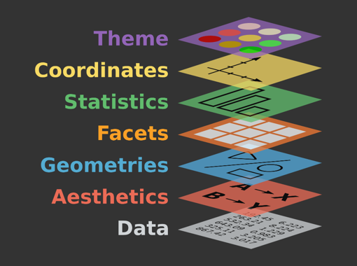
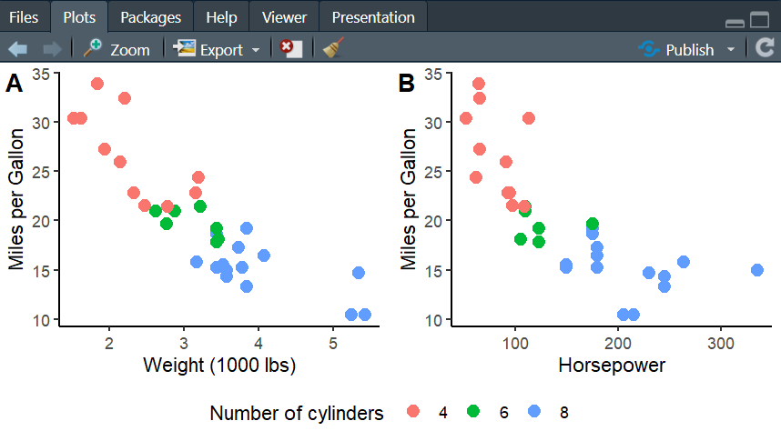

```{r setup, include = FALSE}
knitr::opts_chunk$set(echo = TRUE, warning = FALSE, message = FALSE)
```

```{r, results = "hide", message = F, warning = F, echo = FALSE}
rm(list=ls())

# set directory to source file location
setwd(dirname(rstudioapi::getActiveDocumentContext()$path))
```

# Most common plots

Visualisations play a key role in data analysis by helping us understand patterns, relationships, and distributions within datasets. 

Let's take a moment to review some of the most commonly used types of plots in research. We'll begin by using functions built into base R, which are ideal for producing quick visualisations when you want to explore data efficiently and aesthetic refinement isn't a priority.

We will use the `mtcars` dataset, which comes built into R. This dataset originates from the 1974 Motor Trend US magazine and contains fuel consumption and performance data for 32 car models from the 1970s. It includes variables that let us explore relationships between car design (such as weight, engine size, or number of cylinders) and performance characteristics (like fuel efficiency or acceleration).

```{r}
head(mtcars)
```

## Histograms

A histogram is a type of plot used to visualise the distribution of a single *continuous* variable. It helps reveal the overall shape of the data (for example, whether it is normally distributed or skewed) and can also make it easier to spot potential outliers.

For instance, let's explore how the variable `mpg`, which represents miles per gallon for each car in the dataset, is distributed:

```{r}
hist(mtcars$mpg,
     main = "Histogram of Miles per Gallon (MPG)",
     xlab = "Miles per Gallon", breaks = 5,
     col = "lightblue", 
     border = "white",
     xlim = c(min(mtcars$mpg), 35))
```

This plot shows where the cars fall in terms of miles per gallon and how much variation exists across models. By changing the number of bins using the `breaks` argument, we can vary how much detail we get:

```{r}
hist(mtcars$mpg,
     main = "Histogram of Miles per Gallon (MPG)",
     xlab = "Miles per Gallon", breaks = 10,
     col = "lightblue", 
     border = "white",
     xlim = c(min(mtcars$mpg), 35))
```

## Density plots

A density plot is a smoothed version of a histogram. Instead of grouping data into bins, it estimates the probability density of the variable across its range. Compared to a histogram, a density plot provides a smooth continuous curve, making it easier to see the overall shape of the distribution, and it also allows easier comparison between multiple groups (e.g., overlaying several densities). It also does not depend on arbitrary bin widths that can affect histogram shape.

```{r}
plot(density(mtcars$mpg),
     main = "Density Plot of Miles per Gallon (MPG)",
     xlab = "Miles per Gallon",
     col = "darkblue",
     lwd = 2)

# uncomment the below if you want to fill the area under the curve
# polygon(density(mtcars$mpg), col = "lightblue", border = "darkblue")
```

## Bar plots

A bar plot is a popular way to compare quantities across discrete categories, making it easy to see differences between groups. For example, if we want to examine the average fuel efficiency of cars with different numbers of cylinders, we can use a bar plot:

```{r}
barplot(tapply(mtcars$mpg, mtcars$cyl, mean),
        main = "Average MPG by Number of Cylinders",
        xlab = "Cylinders",
        ylab = "Average MPG",
        col = "orange")
```

This code takes the variable `mtcars$mpg`, which we want to summarise, and the grouping variable `mtcars$cyl`, and applies the `mean` function to each group. In other words, it calculates the average miles per gallon (`mpg`) within each cylinder category.

The `tapply()` function in R performs this operation by applying a specified function (here, `mean`) to subsets of a vector (`mtcars$mpg`) defined by a categorical variable (`mtcars$cyl`). It returns a *named vector*, where the names correspond to the cylinder categories (4, 6, and 8) and the values represent the average `mpg` for each group.

Finally, the `barplot()` function takes this named vector and creates a bar for each cylinder group, using the category names as labels and the mean `mpg` values as the bar heights.

One important point to note is that while the bar plot shows the averages, it does not display the *variation* within each category. Means can be heavily influenced by outliers, so it is generally **not advisable to show only the mean values**. You should always include *standard errors* or some measure of variation, so that readers can see the uncertainty associated with the averages:

```{r}
# function to calculate standard error
se <- function(x) sd(x) / sqrt(length(x))

# calculate mean MPG and standard errors by cylinder
avg_mpg <- tapply(mtcars$mpg, mtcars$cyl, mean)
se_mpg <- tapply(mtcars$mpg, mtcars$cyl, se)

# create bar plot
bp <- barplot(avg_mpg,
              main = "Average MPG by Cylinder with Standard Errors",
              xlab = "Cylinders",
              ylab = "Average MPG",
              col = "orange",
              ylim = c(0, max(avg_mpg + se_mpg) + 2))  # extend y-axis for error bars

# Add error bars (2 SEs)
arrows(x0 = bp, y0 = avg_mpg - 2*se_mpg,
       x1 = bp, y1 = avg_mpg + 2*se_mpg,
       angle = 90, code = 3, length = 0.1, col = "black")
```

### Stacked / proportional bar plots

If you are comparing parts of a whole across different categories, it can be useful to use a stacked or proportional bar plot. *Stacked* bar plots show how subgroups contribute to totals, while *proportional* stacked bar plots standardise those totals so you can compare relative proportions even when overall group sizes differ.

For example, we can use a stacked bar plot to compare the number of automatic versus manual transmissions across different numbers of cylinders. We start by creating a table with frequencies for the relevant levels of each variable:

```{r}
# Create a frequency table
tbl <- table(mtcars$cyl, mtcars$am)
tbl
```

We can then plot the data from this table as follows:

```{r}
barplot(
  t(tbl), # need to transpose to show n cylinders on x-axis
  beside = FALSE,  # stacked (not grouped)
  main = "Transmission type by number of cylinders",
  xlab = "Number of cylinders",
  ylab = "Count",
  col = c("skyblue", "orange"),
  legend.text = c("Automatic", "Manual"),
  names.arg = rownames(tbl))  # adds 4, 6, 8 as x-axis labels
```

The legend is overlapping the plot, so let's move it outside the plotting area:

```{r}
# increase right margin so there is room for the legend
par(mar = c(5, 4, 4, 9))  # bottom, left, top, right

# Stacked bar plot
barplot(
  t(tbl),
  beside = FALSE, 
  main = "Transmission type by number of cylinders",
  xlab = "Number of cylinders",
  ylab = "Count",
  col = c("skyblue", "orange"),
  names.arg = rownames(tbl),
  legend.text = c("Automatic", "Manual"),
  args.legend = list(x = "topright", inset = c(-0.3, 0), xpd = TRUE)) # moves legend outside
```

If you want to look at proportions instead of raw counts, you can use a proportional bar plot, which normalises each bar to 100% height and shows relative proportions rather than counts. To do this, we first convert the counts in the frequency table to proportions using the `prop.table()` function. How the proportions are calculated is controlled by the `margin = ` argument: if it is set to 1, each row will sum to 100%:

```{r}
par(mar = c(5, 4, 4, 9)) 

# Create proportional table
prop_tbl <- prop.table(tbl, margin = 1)

# Proportional stacked bar plot
barplot(
  t(prop_tbl), # transpose to have cylinders on x-axis
  beside = FALSE, # stacked bars
  main = "Transmission type by number of cylinders",
  xlab = "Number of cylinders",
  ylab = "Proportion",
  col = c("skyblue", "orange"),
  names.arg = rownames(tbl),
  legend.text = c("Automatic", "Manual"),
  args.legend = list(x = "topright", inset = c(-0.3, 0), xpd = TRUE))
```

These plots can be useful, but one disadvantage is that only the bottom segment shares a common baseline, making the middle and top segments harder to compare across categories. I also wouldn't recommend using this type of plot with more than two, or at most three, categories, as it quickly becomes visually busy and difficult to interpret. A better alternative might be faceted plots, which we'll look at later.

## Box plots

The bar plot with standard errors is certainly an improvement, but we can provide even more information about the distribution of `mpg` across cars with different numbers of cylinders. For instance, it is often useful to see the *medians*, *quartiles*, and *potential outliers* in the data. A good way to visualise all of this at once is with a box plot.

```{r}
boxplot(mpg ~ as.factor(cyl),
        data = mtcars,
        main = "Box plot of MPG by Number of Cylinders",
        xlab = "Cylinders",
        ylab = "Miles per Gallon",
        col = c("lightgreen", "lightblue", "lightpink"))
```

In this graph,

- the thick line inside each box shows the *median* `mpg` for that cylinder group;

- the heights of the boxes show the middle 50% of the data (called the *interquartile range*), which gives a sense of variability (here, we see that there is much more variability across cars with 4 cylinders than across cars with a higher number of cylinders);

- the lines extending from the boxes are called *whiskers* and reach to the smallest and largest values within 1.5 times the interquartile range;

- hollow circles with black outlines indicate points beyond 1.5 times the interquartile range and are often referred to as potential *outliers*.

Overall, the box plot reveals that cars with 4 cylinders generally have higher `mpg`, but there is some overlap with 6-cylinder cars, and a few 8-cylinder cars have unusually low `mpg` values. We also see that fuel efficiency varies much more in 4-cylinder cars than in cars with more cylinders. This level of detail is not visible in a simple bar plot.

Note that a box plot can also be used to examine a single continuous variable; it is not limited to comparing two variables:

```{r}
boxplot(mtcars$mpg,
        main = "Box plot of Miles per Gallon (MPG)",
        ylab = "Miles per Gallon",
        col = "lightblue")
```

Box-and-whiskers plots are certainly an improvement over simple bar plots. However, while we can see summary statistics such as medians and quartiles, we still don't get a full picture of the data distribution. If we could combine the box plot with a density plot, we would have a much richer visualisation. Fortunately, there is a type of plot that does exactly that - the *raincloud plot*. Base R doesn't include a built-in function for these plots, but we will revisit this later when we explore specialised plotting packages in R.

## Scatter plots

So far, we have explored how to examine the summary statistics and distribution of a single continuous variable using histograms, density plots, and box plots. We also saw how to investigate the relationship between a continuous variable and a categorical variable with bar plots and box plots. But how can we visualise the relationship between two continuous variables? The most commonly used plot for this purpose is the scatter plot.

```{r}
plot(mtcars$wt, mtcars$mpg,
     main = "Scatter plot of Weight vs. MPG",
     xlab = "Weight (1000 lbs)",
     ylab = "Miles per Gallon",
     pch = 19,
     col = "darkgreen")
```

The plot above allows us to examine how a car's weight (`wt`) relates to its miles per gallon (`mpg`) in the `mtcars` dataset. Each point represents an individual car, and we can observe a negative relationship: heavier cars tend to have lower fuel efficiency.

Scatter plots like this are particularly useful for exploring associations or correlations between two continuous variables. They help identify trends, clusters, or unusual observations in the data and are often used in conjunction with correlation and regression analyses.

## Line plots

Another type of plot that is very common and useful in research when working with two continuous variables is a line plot. As the name suggests, this plot is a line! It is typically used to show how a continuous variable *changes over an ordered sequence*, such as time, an index, or any naturally ordered variable. Line plots are particularly helpful for identifying trends, patterns, or fluctuations over that sequence. 

Line plots are similar to scatter plots in that they depict a relationship between two variables, but here the focus is on the change *within one variable across an ordered set of observations*, which is represented by the other variable.

We do not really have variables that change over time in the `mtcars` dataset, but we can use other built-in datasets to illustrate this. For example, the `AirPassengers` dataset can be used to show monthly totals of international airline passengers from 1949 to 1960:

```{r}
plot(AirPassengers,
     type = "l",
     main = "Monthly Airline Passengers (1949–1960)",
     xlab = "Year",
     ylab = "Number of Passengers",
     col = "blue",
     lwd = 2)
```

It shows clearly that, while there are fluctuations within each year, the overall number of passengers steadily increases across the years.

Similarly, we can use the `pressure` dataset to examine how the vapor pressure of mercury changes as a function of temperature:

```{r}
plot(pressure$temperature, pressure$pressure,
     type = "l",
     main = "Vapor pressure of mercury vs. Temperature",
     xlab = "Temperature (°C)",
     ylab = "Pressure (mm Hg)",
     col = "red",
     lwd = 2)
```

We can see that vapor pressure changes systematically with the ordered variable `Temperature`.

## Interim summary

We've now looked at some of the most common plots using functions built into R. These functions are useful because the plots are quick to create and require very little information. If all you need is a fast visual, they work perfectly. In fact, even without specifying any attributes, you can still get a sense of the data:

```{r}
hist(pressure$temperature)
plot(mtcars$mpg, mtcars$wt)
```

However, these base R plots are not particularly pretty, and it can be cumbersome to add layers or extra information. They also lack the ability to create more complex visuals, such as heatmaps or Sankey-style diagrams. For this reason, base R plotting functions are generally not used for figures in scientific publications.

Instead, most people use `ggplot2`, a visualisation package in R that is both powerful and flexible. Since its introduction, it has become **the gold standard** for data visualisation in R. One of its greatest advantages is that it was designed to work seamlessly with `tidyr` and `dplyr`, providing full integration that makes data cleaning and visualisation workflows straightforward. 

To load `ggplot2`, you can either use `library("ggplot2")`, or you can load the `tidyverse` package, which includes `ggplot2` along with `tidyr`, `dplyr`, and other useful packages:

```{r}
library("tidyverse")
```

# Plotting with `ggplot2`

In `ggplot2`, plots are built up using a *layered approach*, where each layer adds a different component to the visualisation. 

```{r, echo = F, fig.align = 'center', out.width = '60%'}

```

- The *data* layer specifies the dataset you are working with;

- The *aesthetics* layer (`aes`) maps variables to visual properties, such as x- and y-axes, colour, size, or shape; 

- *Geometric objects* (`geoms`) define the type of plot you want, such as points, lines, bars, or boxplots; 

- *Facets* allow you to create multiple subplots based on a categorical variable, making it easy to compare groups side by side;

- The *statistics* layer can add summary calculations, such as means, medians, or regression lines;

- The *coordinates* layer controls the coordinate system and axes; 

- Finally, the *theme* layer is used to adjust the overall appearance of the plot, including fonts, colours, grid lines, and spacing.

We will now see how this works in practice by recreating the figures we previously plotted using base R functions, but this time using `ggplot2`.

## Histograms

```{r}
# data and aesthetics layer
ggplot(mtcars, aes(x = mpg)) +
  # geometric object layer
  geom_histogram()
```

Let's break down what's happening here step by step:

- The first line of code, `ggplot(mtcars, aes(x = mpg))`, tells `ggplot2` which dataset to use (`mtcars`). This represents the first layer - the *data layer*. 

- The `aes()` function defines the *aesthetics layer*, which maps the variable `mpg` to the x-axis. At this stage, no plot is drawn yet, we are simply specifying the data and how it will be represented.

- The next step is to choose the type of plot, which is done using the *geometric object layer* (`geom`). `ggplot2` provides many *geoms*, but here we choose the `geom_histogram()` to draw a histogram. 

At this point, the histogram is drawn, but it doesn't yet match the appearance of the base R example. To adjust its look, we add arguments inside the geom:

- `bins = 5` sets the number of bars in the histogram;

- `fill = "lightblue"` specifies the colour inside the bars;

- `color = "white"` sets the border colour of the bars.

These arguments allow us to customise the basic appearance of the histogram while keeping the underlying data and mapping unchanged:

```{r}
# data and aesthetics layer
ggplot(mtcars, aes(x = mpg)) +
  # geometric object layer
  geom_histogram(bins = 5,              
                 fill = "lightblue", 
                 color = "white")
```

We continue building the plot using the `labs()` function, which adds a title and labels for the x- and y-axes. This helps make the plot easier to read and understand:

```{r}
# data and aesthetics layer
ggplot(mtcars, aes(x = mpg)) +
  # geometric object layer
  geom_histogram(bins = 5,              
                 fill = "lightblue", 
                 color = "white") +
  # labels
  labs(title = "Histogram of Miles per Gallon (MPG)",
       x = "Miles per Gallon",
       y = "Count") 
```

Finally, the default grey background and grid don't look nice and add visual clutter. We can remove these using the *theme layer*: `theme_classic()` provides a simple, clean look with a white background and no gridlines.

```{r}
# data and aesthetics layer
ggplot(mtcars, aes(x = mpg)) +
  # geometric object layer
  geom_histogram(bins = 5,              
                 fill = "lightblue", 
                 color = "white") +
  # labels
  labs(title = "Histogram of Miles per Gallon (MPG)",
       x = "Miles per Gallon",
       y = "Count") +
  # theme
  theme_classic()  
```

You may be wondering how to know which options to use to make specific changes or what kinds of customisations are available. There are many excellent resources that explain what `ggplot2` can do and how to take full advantage of its flexibility (see final section of this file for links). As a starting point, you might explore the [official documentation](https://ggplot2.tidyverse.org/) and and the extensive collection of examples at [https://r-graph-gallery.com/ggplot2-package.html](https://r-graph-gallery.com/ggplot2-package.html).

<div style="border: 2px solid green; padding: 10px; margin: 10px 0; background-color: rgba(0, 128, 0, 0.2);">EXERCISE 1: Have a look at [this vignette](https://ggplot2.tidyverse.org/reference/ggtheme.html) to see the available themes, and consider the advantages and disadvantages of each. Then try experimenting with the plot above by changing its theme.</div>

## Density plots

Let's now recreate the density plot we made earlier. The data and aesthetics remain unchanged because we are still working with the `mpg` variable. The theme also stays the same, as we want the clean white background provided by `theme_classic()`. The geometric object layer is now `geom_density()` instead of `geom_histogram()`, which creates a smooth curve representing the distribution of `mpg`. Finally, the labels are updated using `labs()` to reflect that this is a density plot rather than a histogram:

```{r}
ggplot(mtcars, aes(x = mpg)) + 
  geom_density() + 
  labs(title = "Density plot of Miles per Gallon (MPG)", x = "Miles per Gallon", y = "Density") +
theme_classic() 
```

Like with `geom_histogram()`, to change the appearance of the curve, we can use arguments like `fill`, `color`, and `adjust`:

- `fill = "lightblue"` sets the colour under the density curve;

- `color = "white"` sets the border of the curve;

- `adjust = 1.5` controls the smoothness of the curve (larger values make it smoother).

```{r}
ggplot(mtcars, aes(x = mpg)) + 
  geom_density(fill = "lightblue", color = "white", adjust = 1.5) + 
  labs(title = "Density plot of Miles per Gallon (MPG)", x = "Miles per Gallon", y = "Density") +
theme_classic() 
```

<div style="border: 2px solid green; padding: 10px; margin: 10px 0; background-color: rgba(0, 128, 0, 0.2);">EXERCISE 2: Try changing the values of the "adjust" argument to see how the curve responds to different levels of smoothness. Which values strike the best balance between showing enough detail without overfitting the data?</div>

## Box plots with one variable

Like before, we only need to make a few small changes to the plot. 

The `geom` is now `geom_boxplot()`, and we can specify the `fill` and `color` arguments to adjust its appearance. We also update the title and axis labels to reflect that we are now creating a box plot. The main change, however, is that we map the variable `mpg` to the y-axis instead of the x-axis, because this is what the `geom_boxplot()` function expects. As a result, the axis labels change accordingly.

```{r}
ggplot(mtcars, aes(y = mpg)) +
  geom_boxplot(fill = "lightblue",
               color = "black") +
  labs(title = "Box plot of Miles per Gallon (MPG)",
       y = "Miles per Gallon") +
  theme_classic()
```

## Raincloud plots with one variable

Recall that we mentioned earlier that a raincloud plot combines features of a box plot and a density plot. Like a box plot, it shows the median and interquartile range, but it also displays the full distribution of the data through the shape of a rotated density plot. This allows us to see both the summary statistics and the underlying distribution in one figure.

Also remember that base R does not include a built-in function for creating raincloud plots — but now that we are using `ggplot2`, we can easily produce one with just a few lines of code.

The first step is to produce the basic shape, and we can do this using the `geom_violin` geom:

```{r}
ggplot(mtcars, aes(x = "", y = mpg)) +
  geom_violin(fill = "lightblue", 
              color = "black") +
  labs(title = "Violin plot of Miles per Gallon (MPG)", 
       y = "Miles per Gallon", x = NULL) +
  theme_classic()  
```

`geom_violin()` requires both `x` and `y` aesthetics. However, since we are only plotting one variable, we set `x = ""` (an empty string) to tell `ggplot2` to treat all the data as belonging to a single category. `geom_violin()` then uses this "dummy" x variable to create a single violin representing the distribution of `mpg`. Setting `x = NULL` inside `labs()` removes the unnecessary x-axis label.

<div style="border: 2px solid green; padding: 10px; margin: 10px 0; background-color: rgba(0, 128, 0, 0.2);">EXERCISE 3: Try creating violin plots for other *continuous* variables in the `mtcars` dataset.</div>

Let's now add the interquartile range:

```{r}
ggplot(mtcars, aes(x = "", y = mpg)) +
  geom_violin(fill = "lightblue", 
              color = "black") +
  geom_boxplot(width = 0.1, fill = "blue", 
               outlier.colour = "blue", outlier.shape = 16, outlier.size = 2) +
  labs(title = "Violin plot of Miles per Gallon (MPG)", 
       y = "Miles per Gallon", x = NULL) +
  theme_classic()
```

Now add the individual data points:

```{r}
ggplot(mtcars, aes(x = "", y = mpg)) +
  geom_violin(fill = "lightblue", 
              color = "black") +
  geom_boxplot(width = 0.1, fill = "blue", 
               outlier.colour = "blue", outlier.shape = 16, outlier.size = 2) +
  geom_jitter(width = 0.05, alpha = 0.6, color = "black") +
  labs(title = "Violin plot of Miles per Gallon (MPG)", 
       y = "Miles per Gallon", x = NULL) +
  theme_classic()
```

<div style="border: 2px solid green; padding: 10px; margin: 10px 0; background-color: rgba(0, 128, 0, 0.2);">EXERCISE 4: Try changing the shape and size of the outlier and / or individual data points using [this guide](https://ggplot2.tidyverse.org/articles/ggplot2-specs.html).</div>

Might also be useful to flip this plot so that the distribution lies horizontally because this makes the plot more visually appealing, we use `coord_flip()`:

```{r}
ggplot(mtcars, aes(x = "", y = mpg)) +
  geom_violin(fill = "lightblue", 
              color = "black") +
  geom_boxplot(width = 0.1, fill = "blue", 
               outlier.colour = "blue", outlier.shape = 16, outlier.size = 2) +
  geom_jitter(width = 0.05, alpha = 0.6, color = "black") +
  labs(title = "Violin plot of Miles per Gallon (MPG)", 
       y = "Miles per Gallon", x = NULL) +
  theme_classic() + 
  coord_flip()   # flips the axes
```

See the little tick mark? Let's remove it. To do this, we need to change settings in the `theme()` area:

```{r}
ggplot(mtcars, aes(x = "", y = mpg)) +
  geom_violin(fill = "lightblue", 
              color = "black") +
  geom_boxplot(width = 0.1, fill = "blue", 
               outlier.colour = "blue", outlier.shape = 16, outlier.size = 2) +
  geom_jitter(width = 0.05, alpha = 0.6, color = "black") +
  labs(title = "Violin plot of Miles per Gallon (MPG)", 
       y = "Miles per Gallon", x = NULL) +
  theme_classic() + coord_flip() +
    theme(
    axis.ticks.y = element_blank())   # remove x-axis ticks
```

This is also where we can change things like size and face of axes labels:

```{r}
ggplot(mtcars, aes(x = "", y = mpg)) +
  geom_violin(fill = "lightblue", 
              color = "black") +
  geom_boxplot(width = 0.1, fill = "blue", 
               outlier.colour = "blue", outlier.shape = 16, outlier.size = 2) +
  geom_jitter(width = 0.05, alpha = 0.6, color = "black") +
  labs(title = "Violin plot of Miles per Gallon (MPG)", 
       y = "Miles per Gallon", x = NULL) +
  theme_classic() + coord_flip() +
    theme(
    axis.ticks.y = element_blank(),
    axis.text.x = element_text(size = 12),  # increase y-axis tick labels
    axis.title.x = element_text(size = 14)) # y-axis title size
```

<div style="border: 2px solid green; padding: 10px; margin: 10px 0; background-color: rgba(0, 128, 0, 0.2);">EXERCISE 5: Try changing the face of the x-axis and title using [this guide](https://ggplot2.tidyverse.org/reference/theme.html).</div>

Looks nice, doesn't it? We can make the plot even cleaner by reducing it to a half violin, which shows the same information but takes up less space and makes it easier to compare multiple groups side by side (which will be relevant later). To do this, we'll use the `ggdist` package, which provides the `stat_halfeye()` function designed specifically for half violins and other advanced distribution visualisations:

```{r}
library("ggdist")

 # specify dataset and map mpg to y-axis (x=1 is a placeholder since we have one group)
ggplot(mtcars, aes(x = 1, y = mpg)) + 
  
  # add a half-violin shape to show the distribution of mpg
  stat_halfeye(
    adjust = 0.5, # controls smoothing of the density curve
    justification = -0.3, # moves the half violin horizontally
    fill = "lightblue", # fill colour for the violin
   # .width = 0, # uncomment to remove onfidence intervals
   # point_colour = NA, # uncomment to remove the mean
    position = position_nudge(x = -0.15)) + # nudges violin down or spacing
  
  # add a boxplot showing median and interquartile range
  geom_boxplot(
    width = 0.1, # makes the boxplot narrower
    fill = "lightblue", # match violin colour
    outlier.colour = "black", # colour for outlier points
    outlier.shape = 16, # solid round outlier points
    outlier.size = 2, # size of outlier points
    position = position_nudge(x = -0.30)) + # moves the boxplot vertically
  
  # add individual data points for more detail
  geom_jitter(
    width = 0.05, # horizontal spread of points
    alpha = 0.6, # transparency level
    color = "blue") + # point colour
  
  # add plot title and axis labels
  labs(title = "Raincloud plot of Miles per Gallon (MPG)",
    y = "Miles per Gallon",
    x = NULL) +
  
  # flip coordinates so the violin lies horizontally
  coord_flip() +
  
  # use a clean theme
  theme_classic() +
  
  # remove y-axis ticks and labels (not needed for single group)
  theme(axis.ticks.y = element_blank(),
    axis.text.y = element_blank())
```

So much is happening here, but this plot gives us a *lot of* information! We can clearly see the distribution of the data through the half-violin, the mean and its 95% confidence interval, and the boxplot showing the median and interquartile range. On top of that, we also have the individual data points (spread out with a bit of random noise using jitter so that overlapping points are easier to see). This combination gives us a rich and detailed view of the data — both the overall pattern and the individual observations.

<div style="border: 2px solid green; padding: 10px; margin: 10px 0; background-color: rgba(0, 128, 0, 0.2);">EXERCISE 6: Using what you've learned from the previous exercises, experiment with this plot by modifying its theme, fonts, points, and other components.</div>

Let's now see how we can create plots with `ggplot2` that show the relationship between *two* (or more) variables. We'll look at bar plots, scatter plots, and line plots, as well as how to use box plots and raincloud plots for visualising differences across groups.

## Bar plots

Recall that we said earlier that bar plots are much more useful when we are also plotting variation, so the first step to do is to compute standard errors. One way to do this was shown above, here we can look at two other ways to do that. We can keep using the function `se` we've defined above with combination with some `dplyr` functions:

```{r}
# Summarise data: mean and standard error of mpg by cylinder
mpg_summary <- mtcars %>%
  dplyr::group_by(cyl) %>%
  dplyr::summarise(
    mean_mpg = mean(mpg),
    se_mpg = se(mpg))
```

This code creates a new data frame with the summary statistics - very useful as we can draw data from here when we plot:

```{r}
mpg_summary
```

Alternatively, we can use the function `summarySE` from the `Rmisc` package, which does the same in one line, and does not require defining a function to compute SEs:

```{r}
library("Rmisc")

mpg_summary <- summarySE(mtcars, measurevar = "mpg", groupvars = "cyl")
mpg_summary
```

<div style="border: 2px solid green; padding: 10px; margin: 10px 0; background-color: rgba(0, 128, 0, 0.2);">EXERCISE 7: Take a look at the `summarySEwithin()` function from the same package (see [here](https://cran.r-project.org/web/packages/Rmisc/Rmisc.pdf) for package documentation) and consider in which experimental designs it would be more appropriate to use than `summarySE()`.</div>

Ok, now we are ready to plot!

```{r}
# Start a ggplot object using mpg_summary dataset
# by mapping x-axis to cylinders, y-axis to mean mpg
ggplot(mpg_summary, aes(x = factor(cyl), y = mpg)) +
  # define fill colour and border colour of the bars
  geom_col(fill = "orange", color = "black") +
  # add SEs
  geom_errorbar(
    aes(ymin = mpg - 2*se, ymax = mpg + 2*se),
    width = 0.2, color = "black") +
  labs(title = "Average MPG by Cylinder",
    x = "Cylinders",
    y = "Average MPG") +
  theme_classic()
```

Sometimes, people like to use different colours for the levels of a factor variable, like so:

```{r}
ggplot(mpg_summary, aes(x = factor(cyl), y = mpg, fill = factor(cyl))) +
  geom_col(color = "black") +
  geom_errorbar(
    aes(ymin = mpg - 2*se, ymax = mpg + 2*se),
    width = 0.2, color = "black") +
  labs(title = "Average MPG by Cylinder",
    x = "Cylinders",
    y = "Average MPG") +
  theme_classic()
```

People often leave their plots looking like this. I can see three problems here - can you spot any?

The first issue is that the legend title for the cylinder variable isn't very descriptive. We can fix that by giving it a clearer label, like this:

```{r}
ggplot(mpg_summary, aes(x = factor(cyl), y = mpg, fill = factor(cyl))) +
  geom_col(color = "black") +
  geom_errorbar(
    aes(ymin = mpg - 2*se, ymax = mpg + 2*se),
    width = 0.2, color = "black") +
  labs(title = "Average MPG by Cylinder",
    x = "Cylinders",
    y = "Average MPG",
    fill = "Number of cylinders") + # set legend for fill
  theme_classic()
```

However, in this particular case, we don't actually *need* a legend. The x-axis already clearly tells us which bar corresponds to which cylinder type, so the legend just adds unnecessary visual clutter. That's our second issue. So let's remove this legend:

```{r}
ggplot(mpg_summary, aes(x = factor(cyl), y = mpg, fill = factor(cyl))) +
  geom_col(color = "black") +
  geom_errorbar(
    aes(ymin = mpg - 2*se, ymax = mpg + 2*se),
    width = 0.2, color = "black") +
  labs(title = "Average MPG by Cylinder",
    x = "Cylinders",
    y = "Average MPG") +
  theme_classic() +
   theme(legend.position = "none") # removes fill legend
```

But the main problem remains: the use of colour here doesn't actually add any new information. Each bar already represents a different number of cylinders, so using different colours for each one is redundant. In fact, it can be confusing - the viewer might start wondering what the colours are supposed to mean.

A cleaner approach is to use a single colour for all bars. For example, we can make all bars orange, or simply use black outlines for a minimalist look:

```{r}
ggplot(mpg_summary, aes(x = factor(cyl), y = mpg)) +
  geom_col(color = "black") +
  geom_errorbar(
    aes(ymin = mpg - 2*se, ymax = mpg + 2*se),
    width = 0.2, color = "black") +
  labs(title = "Average MPG by Cylinder",
    x = "Cylinders",
    y = "Average MPG") +
  theme_classic()
```

This illustrates an important principle of data visualisation: every design choice should serve a purpose. Colour, in particular, should be used *meaningfully* - not just for decoration. Aim to make your plots as minimal as possible while remaining as informative as possible.

### Stacked / proportional bar plots

As mentioned earlier, these plots are not always the most helpful, but let's still see how we can recreate them with `ggplot2` as an exercise.

Last time, we computed a frequency table using the `table()` function. Now, we'll see how to do the same thing using `tidyverse` functions:

```{r}
mtcars2 <- mtcars %>%
  mutate(cyl = factor(cyl), # coverts cyl to factor
    am = factor(am, labels = c("Automatic", "Manual"))) %>% # assignes descriptive labels to am
  dplyr::count(cyl, am)  # counts for each combination

mtcars2
```

Now we are ready to plot:

```{r}
ggplot(mtcars2, aes(x = cyl, y = n, fill = am)) +
  geom_bar(stat = "identity") +
  labs(title = "Transmission type by number of cylinders",
    x = "Number of cylinders",
    y = "Count",
    fill = "Transmission") +
  theme_classic()
```

An important point to note is that here we are using `geom_bar()` rather than `geom_col()` in combination with `geom_errorbar()` as we did before. In `ggplot2`, `geom_bar()` by default *counts the number of observations* in each category. However, since we have already calculated these counts ourselves, we set `stat = "identity"` so that `geom_bar()` uses the pre-calculated values in the `n` column.

If we wanted `geom_bar()` to count the observations automatically, we would simply use it without `stat = "identity"`, like this:

```{r}
# no counting is done here
mtcars3 <- mtcars %>%
  mutate(cyl = factor(cyl),
    am = factor(am, labels = c("Automatic", "Manual")))

ggplot(mtcars3, aes(x = cyl, fill = am)) + # y-axis not specified
  geom_bar() + # ggplot counts the number of rows for each group automatically
  labs(title = "Transmission type by number of cylinders",
    x = "Number of cylinders",
    y = "Count",
    fill = "Transmission") +
  theme_classic()
```

<div style="border: 2px solid green; padding: 10px; margin: 10px 0; background-color: rgba(0, 128, 0, 0.2);">EXERCISE 8: Looks good! The only thing we need to change is the colours: here we have the default colours, but previously we used orange and blue. Can you figure out how to do this? Hint: use `scale_fill_manual()` to set the colours to `"skyblue"` and `"orange"`.</div>

To create a proportional stacked bar plot, we need to make a slight change in how we compute `mtcars2`, because now we want to work with proportions:

```{r}
mtcars2 <- mtcars %>%
  mutate(cyl = factor(cyl), 
    am = factor(am, labels = c("Automatic", "Manual"))) %>% 
  dplyr::count(cyl, am) %>%
  dplyr::group_by(cyl) %>% # separately for each category of cyl
  mutate(prop = n / sum(n)) # calculate proportions within each category

mtcars2
```

The last two lines here do the trick. We first tell R to treat each cylinder category (4, 6, 8) as a separate group using the `group_by()` function, so that all follow-up calculations are done within each group rather than across the whole dataset. We then divide the count for each transmission type `n` by the total count of cars in that cylinder group `sum(n)` and store the result in a new column `prop`. This converts the raw counts into proportions.

And now let's plot:

```{r}
ggplot(mtcars2, aes(x = cyl, y = prop, fill = am)) +
  geom_bar(stat = "identity") +
  labs(title = "Transmission type by number of cylinders",
    x = "Number of cylinders",
    y = "Proportion",
    fill = "Transmission") +
  theme_classic()
```

Note that, here again, we specify `stat = "identity"` because we don't want `geom_bar()` to automatically compute raw counts as we are interested in proportions. However, we could achieve the same result by setting the `position` argument of `geom_bar()` to `"fill"`, like this:

```{r}
ggplot(mtcars3, aes(x = cyl, fill = am)) +
  geom_bar(position = "fill") +
  labs(title = "Transmission type by number of cylinders",
    x = "Number of cylinders",
    y = "Proportion",
    fill = "Transmission") +
  theme_classic()
```

The `position` argument in `geom_bar()` (and other geoms) controls how multiple bars or segments are arranged relative to each other. If we set it to `"fill"`, the bars are scaled to the same height (100%), which shows proportions rather than raw counts.  

<div style="border: 2px solid green; padding: 10px; margin: 10px 0; background-color: rgba(0, 128, 0, 0.2);">EXERCISE 9: Try changing the value of the `position` argument to `"dodge"`: can you figure out what `"dodge"` does? We've already seen another use of `position` when we worked with boxplots and `stat_halfeye`; how does `"dodge"` compare to that?</div>

## Scatter plots

Let's now recreate the scatter plot of weight and miles per gallon that we made earlier. To create a plot with points, we use `geom_point()`. Everything else follows the same logic as before:

```{r}
ggplot(mtcars, aes(x = wt, y = mpg)) +
  geom_point(color = "darkgreen", size = 3) +
  labs(title = "Scatter plot of Weight vs. MPG",
       x = "Weight (1000 lbs)",
       y = "Miles per Gallon") +
  theme_classic()
```

One additional thing worth demonstrating here is how to adjust the font size of the axis labels and tick marks to make the plot easier to read:

```{r}
ggplot(mtcars, aes(x = wt, y = mpg)) +
  geom_point(color = "darkgreen", size = 3) +
  labs(title = "Scatter Plot of Weight vs. MPG",
       x = "Weight (1000 lbs)",
       y = "Miles per Gallon") +
  theme_classic() +
  theme(
    axis.title = element_text(size = 14), 
    axis.text = element_text(size = 12))
```

One thing that we often want to do is show how a relationship between two variables is affected by another variable - this is what we are interested in when we run models with an interaction effect. For example, this scatter plot seems to suggest that heavier cars tend to have lower miles per gallon, but how does this interact with the number of cylinders? We can bring in this extra variable using colour:

```{r}
ggplot(mtcars, aes(x = wt, y = mpg, color = factor(cyl))) +
  geom_point(size = 3) + 
  labs(title = "Scatter plot of Weight vs. MPG by number of cylinders",
       x = "Weight (1000 lbs)",
       y = "Miles per Gallon",
       color = "Number of cylinders") +
  theme_classic()
```

Note that in this case, we do need the legend for colour because if we just look at dots with different colours we have no idea what colour represents here!

<div style="border: 2px solid green; padding: 10px; margin: 10px 0; background-color: rgba(0, 128, 0, 0.2);">EXERCISE 10: Modify this plot so that, instead of using colour, cars with different numbers of cylinders are distinguished by different point shapes (e.g., circles, triangles, and squares).</div>

Now what we also see that is that the most efficient cars tend to be the lighest ones and also have the smallest number of cylinders, while the least efficient cars are also heaviest and have the highest number of cylinders. Neat!

Another way to bring in a third variable - if it is categorical - is to use facets:

```{r}
ggplot(mtcars, aes(x = wt, y = mpg, color = factor(cyl))) +
  geom_point(size = 3) +
  labs(title = "Scatter Plot of Weight vs. MPG Faceted by number of cylinders",
       x = "Weight (1000 lbs)",
       y = "Miles per Gallon",
       color = "Number of cylinders") +
facet_wrap(~cyl) + # creates one facet per cylinder type
  theme_classic()
```

Here, `facet_wrap(~cyl)` tells `ggplot2` to create a separate plot for each unique value of `cyl`. By default, all facets share the same axis scales, which makes comparison easier. If you want each facet to have its own scale, you can add `scales = "free"` inside `facet_wrap()`, but personally I think it's very rarely worth using different scales because it often makes the comparison between facets really difficult and thus hides an interesting effect. For example:

```{r}
ggplot(mtcars, aes(x = wt, y = mpg, color = factor(cyl))) +
  geom_point(size = 3) +
  labs(title = "Scatter Plot of Weight vs. MPG Faceted by number of cylinders",
       x = "Weight (1000 lbs)",
       y = "Miles per Gallon",
       color = "Number of cylinders") +
facet_wrap(~cyl, scales = "free") + 
  theme_classic()
```

I think this has made the graph worse! Now it actually doesn't tell the story we want it to tell, so there is little point in such a plot.

Number of cylinders is a categorical variable - what if we wanted to add a *continuous* variable, for example `horsepower`?

```{r}
ggplot(mtcars, aes(x = wt, y = mpg, color = hp)) +
  geom_point(size = 3) +
  labs(title = "Scatter Plot of Weight vs. MPG by Horsepower",
       x = "Weight (1000 lbs)",
       y = "Miles per Gallon",
       color = "Horsepower") +
  theme_classic()
```

`hp` is a continuous variable so R understands to use a scale instead of distinct colours, with darker colours indicating lower horsepower and lighter colours indicating higher hoursepower. Actually, this seems a bit unintuitive, so let's change it so that darker colours indicate higher values:

```{r}
ggplot(mtcars, aes(x = wt, y = mpg, color = hp)) +
  geom_point(size = 3) +
  labs(title = "Scatter Plot of Weight vs. MPG by Horsepower",
       x = "Weight (1000 lbs)",
       y = "Miles per Gallon",
       color = "Horsepower") +
  scale_color_continuous(trans = "reverse") + # reverses the default colour gradient
  theme_classic()
```

## Line plots

Let's now see how we can recreate the line plots from before - remember that these are useful when we want to illustrate change over time.

First, we convert the time series to a data frame for ggplot to work:

```{r}
air_passengers_df <- data.frame(
  Year = as.numeric(time(AirPassengers)),
  Passengers = as.numeric(AirPassengers))
```

Now we can plot using `geom_line`:

```{r}
ggplot(air_passengers_df, aes(x = Year, y = Passengers)) +
  geom_line(color = "blue", linewidth = 1) +
  labs(title = "Monthly Airline Passengers (1949–1960)",
       x = "Year",
       y = "Number of Passengers") +
  theme_classic()
```

I think it would be nice if we could show each year:

```{r}
ggplot(air_passengers_df, aes(x = Year, y = Passengers)) +
  geom_line(color = "blue", linewidth = 1) +
  labs(title = "Monthly Airline Passengers (1949–1960)",
       x = "Year",
       y = "Number of Passengers") +
  scale_x_continuous(breaks = seq(1949, 1960, by = 1)) + # show each year
  theme_classic()
```

If you feel like it's a bit difficult to read all the years when they sit next to one another, we can also tilt them at 45 degrees. We can also add more detail for the y-axis:

```{r}
ggplot(air_passengers_df, aes(x = Year, y = Passengers)) +
  geom_line(color = "blue", linewidth = 1) +
  scale_x_continuous(
    breaks = seq(1949, 1960, by = 1)) +  # one tick per year
  scale_y_continuous(
    breaks = seq(100, 600, by = 100)) +  # custom y-axis breaks
  labs(title = "Monthly Airline Passengers (1949–1960)",
       x = "Year",
       y = "Number of Passengers") +
  theme_classic() +
  theme(axis.text.x = element_text(angle = 45, hjust = 1))  # tilt x-axis labels
```

Now we have enough information to see what exactly is happening each year!

Let's do the second line plot from before on vapor pressure and temperature:

```{r}
ggplot(pressure, aes(x = temperature, y = pressure)) +
  geom_line(color = "red", linewidth = 1) +
  labs(title = "Vapor Pressure of Mercury vs. Temperature",
       x = "Temperature (°C)",
       y = "Pressure (mm Hg)") +
  theme_classic()
```

<div style="border: 2px solid green; padding: 10px; margin: 10px 0; background-color: rgba(0, 128, 0, 0.2);">EXERCISE 11: See if you can change the level of detail for the x-axis yourself! While you are at it, play around and remove the title while increasing the font size of the axes text and title, and make axes titles bold too.</div>

## Box plots with 2 variables

We've looked at how to create box plots and we've also looked at how to represent variables with colour. Let's combine these strands of knowledge to create a box plot for `mpg` by number of cylinders (bute note that here again the use of colour does not convey any additional information and is therefore unnecessary):

```{r}
ggplot(mtcars, aes(x = factor(cyl), y = mpg, fill = factor(cyl))) +
  geom_boxplot() +
  labs(title = "Box Plot of MPG by number of cylinders",
       x = "Cylinders",
       y = "Miles per Gallon",
       fill = "Cylinders") +
  theme_classic()
```

<div style="border: 2px solid green; padding: 10px; margin: 10px 0; background-color: rgba(0, 128, 0, 0.2);">EXERCISE 12: Note that the colours here are not identical to what we've created above using base R! Can you figure out how to change them? Hint: like in Exercise 8, you need the function `scale_fill_manual()` to set custom fill colours for each cylinder group.</div>

## Raincloud plots with 2 variables

Finally, let's see how we can create a nice raincloud plot for two variables!

```{r}
# now n cylinders is on the x axis
ggplot(mtcars, aes(x = factor(cyl), y = mpg)) +
  stat_halfeye(
    adjust = 0.5,
    justification = -0.3,
    fill = "lightblue",
    .width = 0, 
    point_colour = NA, 
    position = position_nudge(x = -0.15)) + 
  
  geom_boxplot(
    width = 0.1,      
    fill = "lightblue",      
    outlier.colour = "black",
    outlier.shape = 16,
    outlier.size = 2,
    position = position_nudge(x = -0.25)) + 
  
  geom_jitter(
    width = 0.05, 
    alpha = 0.6, 
    color = "blue") +
  
  labs(title = "Raincloud Plot of Miles per Gallon (MPG) by number of cylinders",
       x = "Number of cylinders",
       y = "Miles per Gallon") +
  
  theme_classic() + coord_flip()
```

Interesting! Now we clearly see that the distribution of miles per gallon in cars with 4 cylinders is closer to uniform than in cars with 8 cylinders, for instance. Again, this just shows how effective raincloud plots are!

## Statistical summaries in `ggplot2`

One of the great strengths of `ggplot2` is that it allows you to compute summary statistics on the fly and overlay them on your plots. This is done using statistical layers, such as `stat_summary()` or specialised geoms like `geom_smooth()`.

### Using `stat_summary()`

`stat_summary()` lets you compute a function (like mean, median, standard deviation, or standard error) for each group and display it as a point, line, or bar. For example, we can plot the mean MPG for each cylinder group with standard error bars like so:

```{r}
ggplot(mtcars, aes(x = factor(cyl), y = mpg)) +
  stat_summary(
    fun = mean, # compute mean
    geom = "point", # display as points
    color = "red",
    size = 3) +
  stat_summary(
    fun.data = mean_se, # compute one SE of the mean
    geom = "errorbar", # draws vertical error bars showing uncertainty
    width = 0.1,
    color = "black") +
  labs(title = "Mean MPG by number of cylinders",
       x = "Cylinders",
       y = "Miles per Gallon") +
  theme_classic()
```

<div style="border: 2px solid green; padding: 10px; margin: 10px 0; background-color: rgba(0, 128, 0, 0.2);">EXERCISE 13: Create the same plot as above, but use horsepower (`hp`) and weight (`weight`) on the x-axis instead of `mpg`.</div>

### Adding regression lines or smoothing

Another common use of statistical layers is modeling relationships with `geom_smooth()`:

```{r}
ggplot(mtcars, aes(x = wt, y = mpg)) +
  geom_point() +
  geom_smooth(method = "lm", se = TRUE, color = "blue") +
  labs(title = "MPG vs. Weight with a regression line",
       x = "Weight (1000 lbs)",
       y = "Miles per Gallon") +
  theme_classic()
```

Here, `geom_smooth(method = "lm")` fits a linear model to the data, and `se = TRUE` adds a shaded confidence interval around the regression line.

Instead of a linear regression (`method = "lm"`), you can use a loess smoother (`method = "loess"`) to capture more complex relationships:

```{r}
ggplot(mtcars, aes(x = wt, y = mpg)) +
  geom_point() +
  geom_smooth(method = "loess", se = TRUE, color = "blue", fill = "lightblue") + # light blue shading instead of default grey
  labs(title = "MPG vs. Weight",
       x = "Weight (1000 lbs)",
       y = "Miles per Gallon") +
  theme_classic()
```

It looks like for these two variables, a straight line is a good fit, but a loess line is useful when you suspect that the relationship is not strictly linear. 

<div style="border: 2px solid green; padding: 10px; margin: 10px 0; background-color: rgba(0, 128, 0, 0.2);">EXERCISE 14: Explore the relationship between the cars' horsepower (`hp`) and weight (`weight`) using `geom_smooth()`.</div>

## Combining plots

So far, we've created individual plots, but sometimes we want to display several plots together in a single figure - for example, to compare different variables or visualisations side by side. This can be done easily using the `ggarrange()` function from the `ggpubr` package.

The first step is to create the individual plots that you want to combine into a single figure and store them as separate objects in your environment. For example, if we are analysing how cars' fuel efficiency relates to their weight and horsepower, we might want to create a figure with two panels: one showing the relationship between fuel efficiency and weight, and the other showing the relationship between fuel efficiency and horsepower.

We already have the code for the first plot, so all we need to do now is store it as an object in our environment, like this (note that I've removed the title because, in academic publications, we typically don't include titles in figures):

```{r}
mpg_vs_wt_plot <- ggplot(mtcars, aes(x = wt, y = mpg)) +
  geom_point() +
  geom_smooth(method = "loess", se = TRUE, color = "blue", fill = "lightblue") + 
  labs(x = "Weight (1000 lbs)",
       y = "Miles per Gallon") +
  theme_classic()
```

The next step is to create the second plot:

```{r}
mpg_vs_hp_plot <- ggplot(mtcars, aes(x = hp, y = mpg)) +
  geom_point() +
  geom_smooth(method = "loess", se = TRUE, color = "blue", fill = "lightblue") +
  labs(x = "Horsepower",
       y = "Miles per Gallon") +
  scale_x_continuous(breaks = seq(0, max(mtcars$hp), by = 50)) + # breaks every 50 units
  theme_classic()

mpg_vs_hp_plot
```

Now we are ready to combine the two plots into one:

```{r}
library("ggpubr")

fig1 <- ggarrange(
  mpg_vs_wt_plot, mpg_vs_hp_plot, # plots you want to combine
  ncol = 2, nrow = 1,       # 2 columns, 1 row (side by side)
  labels = c("A", "B"))      # optional labels for subplots

fig1
```

The `ggarrange()` function offers several arguments that can help make your combined figures look cleaner and more professional. For example, if the plots you're combining share the same legend, you can specify a common legend for both plots. This helps reduce repetition and save space, and makes the figure easier to read:

```{r}
# mpg vs wt, with different colours for different n cylinders
# (plotted above already)
mpg_wt_cyl_plot <- ggplot(mtcars, aes(x = wt, y = mpg, color = factor(cyl))) +
  geom_point(size = 3) + 
  labs(x = "Weight (1000 lbs)",
       y = "Miles per Gallon",
       color = "Number of cylinders") +
  theme_classic()

# mpg vs hp, with different colours for different n cylinders
mpg_hp_cyl_plot <- ggplot(mtcars, aes(x = hp, y = mpg, color = factor(cyl))) +
  geom_point(size = 3) + 
  labs(x = "Horsepower",
       y = "Miles per Gallon",
       color = "Number of cylinders") +
  theme_classic()

fig2 <- ggarrange(
  mpg_wt_cyl_plot, mpg_hp_cyl_plot, 
  ncol = 2, nrow = 1,
  labels = c("A", "B"))

fig2
```

And now combine with a common legend:

```{r}
fig3 <- ggarrange(
  mpg_wt_cyl_plot, mpg_hp_cyl_plot, 
  ncol = 2, nrow = 1,
  labels = c("A", "B"),
  common.legend = TRUE) # use common legend

fig3
```

As you can see, the legend is currently placed at the top of the plot, which I think looks nice. However, we could also move it to the bottom if we prefer:

```{r}
fig4 <- ggarrange(
  mpg_wt_cyl_plot, mpg_hp_cyl_plot, 
  ncol = 2, nrow = 1,
  labels = c("A", "B"),
  common.legend = TRUE,
  legend = "bottom") # change placement of legend

fig4
```

<div style="border: 2px solid green; padding: 10px; margin: 10px 0; background-color: rgba(0, 128, 0, 0.2);">EXERCISE 15: Save any three of the plots we've created above to your environment and combine them into a single figure using `ggarrange()`. Experiment with the layout by arranging the plots side by side or stacked vertically, and explore other arguments to make the combined figure visually appealing.</div>

## Exporting plots

A key consideration when creating figures is how to export them and ensure that the exported version maintains high quality. R provides several ways to export plots, and the choice depends on your needs, such as the desired file format, resolution, and whether you want a vector or raster image. **Raster images** are made of pixels and can become blurry when enlarged, while **vector images** are made of shapes and lines, can be scaled infinitely without losing quality. 

Raster formats:

- PNG: good for web use and general-purpose images, supports transparency;

- JPEG/JPG: suitable for photographs, but uses lossy compression to reduce the file size, which can reduce quality;

- TIFF: high-quality, lossless format often used in publications.

Vector formats:

- PDF: ideal for figures in publications or reports; scalable without losing quality;

- SVG: scalable vector graphics; great for web graphics and figures you may want to edit later.

- EPS: traditional vector format used in journals.

When submitting a paper to a journal, you can usually choose the format of your figures; however, once your paper is accepted, you will need to provide high-quality vector images, so it's important to understand what they are and how to create them.

You may have noticed that the Plots pane in R provides a clickable option to export the image currently displayed:

```{r, echo = F, fig.align = 'center', out.width = '60%'}

```

You can use this option; however, this is not ideal for high-quality or publication-ready figures, as it often produces raster images with limited resolution and less control over dimensions and formatting. The best option is to use the `ggsave()`command, which supports multiple formats and allows precise control over dimensions and resolution:

```{r}
# save as a png
ggsave("fig4.png", plot = fig4, width = 8, height = 6, dpi = 300,
        bg = "transparent")

# save as a pdf
ggsave("fig4.pdf", plot = fig4, width = 8, height = 6)
```

For raster images, set the dpi to 300 or higher to ensure high-quality output. To determine the figure size, consider the intended use: for a paper, follow the journal's author guidelines, which typically specify figure width (in inches or centimeters); for presentation slides (e.g., a 16:9 aspect ratio), a figure around 8–10 inches wide by 5–6 inches tall usually works well.

With `ggsave()`, you can specify the width and height in inches or pixels. For raster images, it's usually best to use pixels, while for vector outputs, specifying dimensions in inches is more natural.

<div style="border: 2px solid green; padding: 10px; margin: 10px 0; background-color: rgba(0, 128, 0, 0.2);">EXERCISE 16: Experiment with saving different figures at various sizes (in pixels or inches) to determine which dimensions work best for each figure, depending on the amount of information it displays.</div>

# A note on colours

So far, we've relied on the default colours in base R or `ggplot2` (with a few exceptions). While these are fine for quick plots, you'll often want to customise colours to make your figures clearer, more appealing, or suitable for publication. There are many ways to define and modify colours in R, depending on what you need.

R recognises colour names (like "orange", "skyblue", "darkgreen") and also accepts hexadecimal colour codes, such as "#E69F00" (a shade of orange) or "#56B4E9" (light blue). You can find a full list of named colours by typing `colors()` in R, or explore palettes on websites such as:

- [https://coolors.co](https://coolors.co)

- [https://colorbrewer2.org](https://colorbrewer2.org)

- [https://r-graph-gallery.com](https://r-graph-gallery.com)

When choosing colours, it's important to think about **accessibility** and **contrast** — especially if your plots might be printed in black and white, or viewed by people with colour vision deficiencies. Packages like `RColorBrewer` and `viridis` provide colourblind-friendly palettes that look great in both colour and grayscale.

### Changing colours for a categorical variable

Recall the scatter plot we created earlier where `ggplot2` automatically assigned discrete colours to different numbers of cylinders. We can manually define our own using `scale_color_manual()` (and the companion function for filled plots is `scale_fill_manual()`):

```{r}
ggplot(mtcars, aes(x = wt, y = mpg, color = factor(cyl))) +
  geom_point(size = 3) +
  labs(title = "Scatter Plot of Weight vs. MPG by cylinder count",
       x = "Weight (1000 lbs)",
       y = "Miles per Gallon",
       color = "Number of cylinders") +
  scale_color_manual(values = c("4" = "#56B4E9", # blue
                                "6" = "#E69F00", # orange
                                "8" = "#009E73")) + # green
  theme_classic()
```

Here we’ve manually mapped each cylinder group to a specific colour using hex codes. The `scale_color_manual()` function is used when your variable is *discrete*.

### Changing colours for a continuous variable

When we mapped horsepower (`hp`) earlier, we used a continuous colour scale. For these types of variables, you can use `scale_color_gradient()` for more control:

```{r}
ggplot(mtcars, aes(x = wt, y = mpg, color = hp)) +
  geom_point(size = 3) +
  labs(title = "Scatter Plot of Weight vs. MPG by Horsepower",
       x = "Weight (1000 lbs)",
       y = "Miles per Gallon",
       color = "Horsepower") +
  scale_color_gradient(low = "lightblue", high = "darkblue") +
  theme_classic()
```

This maps lower horsepower values to lighter blue and higher values to darker blue.

### Using colourblind-friendly palettes

If you're preparing figures for a publication or presentation, it's a good idea to use palettes that are easy to interpret by everyone. One of the most popular and accessible options comes from the `viridis` package:

```{r}
library("viridis")

ggplot(mtcars, aes(x = wt, y = mpg, color = hp)) +
  geom_point(size = 3) +
  scale_color_viridis(option = "plasma") +
  labs(title = "Scatter plot of Weight vs. MPG",
       x = "Weight (1000 lbs)",
       y = "Miles per Gallon",
       color = "Horsepower") +
  theme_classic()
```

<div style="border: 2px solid green; padding: 10px; margin: 10px 0; background-color: rgba(0, 128, 0, 0.2);">EXERCISE 17: Try changing the colours to "viridis","magma", "inferno", or cividis", and see which one you like best. You can then go through all plots we've created above and try to change the colours there too.</div>

The `viridis` palette ensures consistent contrast across the scale and remains readable in grayscale or by people with colour vision deficiencies.

So lots of options for colour! The most important thing is to remember that whatever colour you use, it should add information, not confusion!

# Advanced plots

While `ggplot2` excels at standard plots (scatter, bar, line, etc.), you can also create more specialised visualisations, often with the help of additional packages.

## Heatmaps

A heatmap displays values in a matrix as coloured tiles, making it ideal for visualising correlations or any grid-based data.

For example, if we want to examine how each variable in the `mtcars` dataset correlates with the others, we can compute a correlation matrix and explore it:

```{r}
# Correlation matrix
cor_mat <- round(cor(mtcars), 2)
cor_mat
```

However, this large table of numbers can be hard to interpret, so it's more useful to visualise it as a heatmap:

```{r}
# Ccnvert to long format using pivot_longer
cor_mat_long <- as.data.frame(cor_mat) %>%
  mutate(Var1 = rownames(.)) %>%
  pivot_longer(-Var1, names_to = "Var2", values_to = "Cor_coef")

head(cor_mat_long)

# plot
ggplot(cor_mat_long, aes(x = Var1, y = Var2, fill = Cor_coef)) +
  geom_tile() +
  scale_fill_gradient2(low = "blue", mid = "white", high = "red", midpoint = 0) +
  theme_minimal() +
  labs(title = "Correlation Heatmap")
```

<div style="border: 2px solid green; padding: 10px; margin: 10px 0; background-color: rgba(0, 128, 0, 0.2);">EXERCISE 18: Use what you've learned above to give the axes and the fill / colour legend more descriptive labels, and experiment with different color gradients for the heatmap to see how it affects readability and emphasis.</div>

## Ridgeline plots

Ridgeline plots are a great way to visualise the distribution of a continuous variable across multiple groups. They combine the idea of density plots with a stacked layout, making it easy to compare distributions across categories. The `ggridges` package provides a simple way to create these plots in `ggplot2`.

For example, in the `mtcars` dataset, we can visualise how `mpg` is distributed for cars with different numbers of cylinders:

```{r}
library("ggridges")

ggplot(mtcars, aes(x = mpg, y = factor(cyl), fill = factor(cyl))) +
  geom_density_ridges(alpha = 0.7) +
  theme_classic() +
  labs(
    title = "MPG distribution by cylinder count",
    y = "Number of cylinders",
    x = "Miles per Gallon",
    fill = "Number of cylinders")
```

<div style="border: 2px solid green; padding: 10px; margin: 10px 0; background-color: rgba(0, 128, 0, 0.2);">EXERCISE 19: Earlier, we discussed that colour should always convey meaningful information. Examine this plot carefully to see whether the colours are used meaningfully, and modify it using the techniques we covered above for working with colour.</div>

## Sankey / alluvial diagrams

Sankey or alluvial diagrams are excellent for visualising flows between categories or the distribution of cases across multiple categorical variables. They show how observations move from one category to another, with the width of the flows proportional to counts or weights.

In R, the `ggalluvial` package integrates seamlessly with `ggplot2` to create these diagrams. For example, we can use the `Titanic` dataset used in the [Intro to Quantitative Analysis in R](https://github.com/mariakna/SEDarc2025_Intro_to_Quant_Analysis_in_R/tree/main) session to visualise how passengers were distributed across class and survival status:

```{r}
library("ggalluvial")

# convert Titanic dataset to data frame
data <- as.data.frame(Titanic)

# Create Sankey / alluvial plot
ggplot(data = data,
       aes(axis1 = Class, axis2 = Survived, y = Freq)) +
  geom_alluvium(aes(fill = Survived)) +
  geom_stratum() +
  geom_text(stat = "stratum", aes(label = after_stat(stratum))) +
  theme_classic() +
  theme(
    axis.text.x = element_blank(),   # remove x-axis labels
    axis.ticks.x = element_blank()) +  # remove x-axis ticks +
  labs(title = "Titanic Survival Sankey Diagram",
       y = "Number of passengers",
        x = "Passenger Class / Survival")
```

Here,

- `axis1` and `axis2` define the categorical axes (passanger class and survival status);

- `y = Freq` specifies the size of each flow based on passenger counts;

- `geom_alluvium()` draws the flows connecting categories;

- `geom_stratum()` creates blocks for each category;

- `geom_text(stat = "stratum")` labels the blocks with category names;

- `fill = Survived` colours the flows according to survival status.

Alluvial diagrams are particularly useful for tracking transitions, showing how a population splits across categories, or highlighting patterns in multistage processes. They can also be extended to more than two axes if needed.

<div style="border: 2px solid green; padding: 10px; margin: 10px 0; background-color: rgba(0, 128, 0, 0.2);">EXERCISE 20: Try modifying the diagram above so that it matches the appearance and layout of the plot shown below. Focus on aspects like colours, labels, flow widths, stratum styling, and legend placement to replicate the example.</div>

```{r, echo = F}
ggplot(data = data,
       aes(axis1 = Class, axis2 = Survived, y = Freq)) +
  geom_alluvium(aes(fill = Survived), width = 1/12, alpha = 0.8) +
  geom_stratum(width = 1/12, color = "black") +
  geom_text(stat = "stratum", aes(label = after_stat(stratum)), 
            size = 4, fontface = "bold") +
  scale_fill_brewer(type = "qual", palette = "Set2") +
  theme_classic(base_size = 14) +
  theme(
    axis.text.x = element_blank(), 
    axis.ticks.x = element_blank(),  
    legend.position = "bottom") +
  labs(
    title = "Titanic Survival by Class",
    x = "Passenger Class / Survival",
    y = "Number of Passengers",
    fill = "Survival status")
```

## 3D plots

You can also create 3D plots in R to visualise surfaces or relationships among three variables. However, keep in mind that 3D plots often add complexity and can make it harder for viewers to interpret the data compared to well-designed 2D plots.

Also note that `ggplot2` is primarily a 2D plotting system, so creating real 3D plots requires other packages such as `plotly`, `rgl`, or base R functions like `persp()`.

Here's an example using base R's `persp()` function to show the surface of a volcano:

```{r}
# 3D surface of the volcano dataset
volcano_matrix <- volcano
x <- 1:nrow(volcano_matrix)
y <- 1:ncol(volcano_matrix)

persp(x, y, volcano_matrix,
      theta = 30, phi = 30, 
      col = "lightblue",
      shade = 0.5,
      xlab = "X", ylab = "Y", zlab = "Height")
```

And here is an interactive 3D plot using the `plotly` package, which allows you to rotate, zoom, and explore the surface dynamically:

```{r}
library("plotly")

plot_ly(data = mtcars, x = ~wt, y = ~mpg, z = ~hp,
        color = ~factor(cyl), colors = c("red","green","blue"),
        type = "scatter3d", mode = "markers") %>%
  layout(title = "3D Scatter plot of mtcars")
```

# Further reading and resources

Everything we've covered so far is just a small sample - there's virtually no limit to what you can do with plots in R!

Use the resources provided in this file to explore other types of visualisations and discover the full range of possibilities. In addition, the following websites are great starting points:

- R Graph Gallery: [https://r-graph-gallery.com/](https://r-graph-gallery.com/)

- Intro to `ggplot2`: [https://ggplot2.tidyverse.org/articles/ggplot2.html](https://ggplot2.tidyverse.org/articles/ggplot2.html)

- Basic plotting with `ggplot2`: [https://bookdown.org/rdpeng/RProgDA/basic-plotting-with-ggplot2.html](https://bookdown.org/rdpeng/RProgDA/basic-plotting-with-ggplot2.html)

- Data visualisation with `ggplot2` - Cheat Sheet: [https://rstudio.github.io/cheatsheets/html/data-visualization.html](https://rstudio.github.io/cheatsheets/html/data-visualization.html)

- R for Data Science (R4DS) - Visualisation Chapter: [https://r4ds.had.co.nz/data-visualisation.html](https://r4ds.had.co.nz/data-visualisation.html)

- List of resources for visualisations in R: [https://github.com/erikgahner/awesome-ggplot2](https://github.com/erikgahner/awesome-ggplot2)